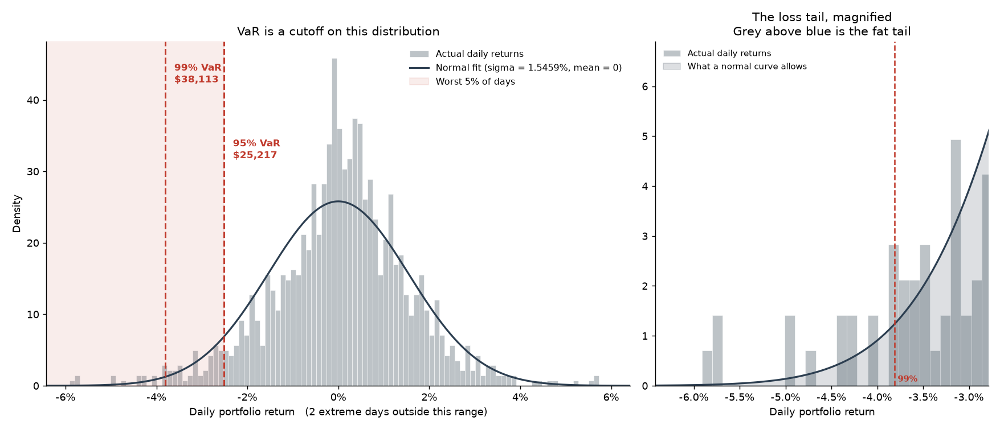
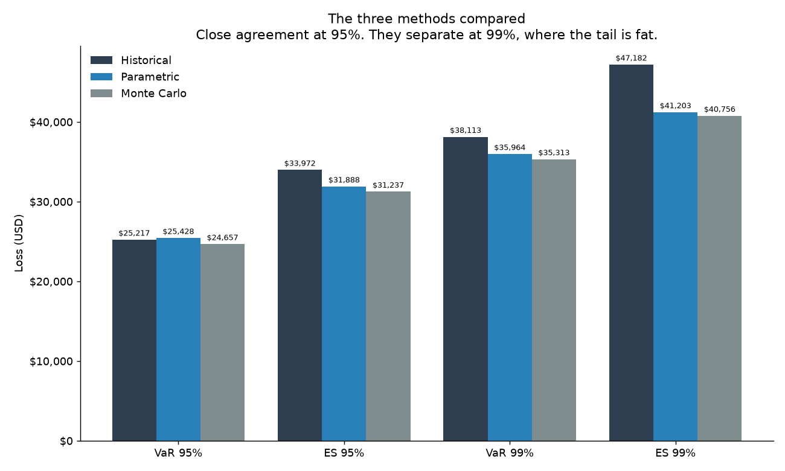
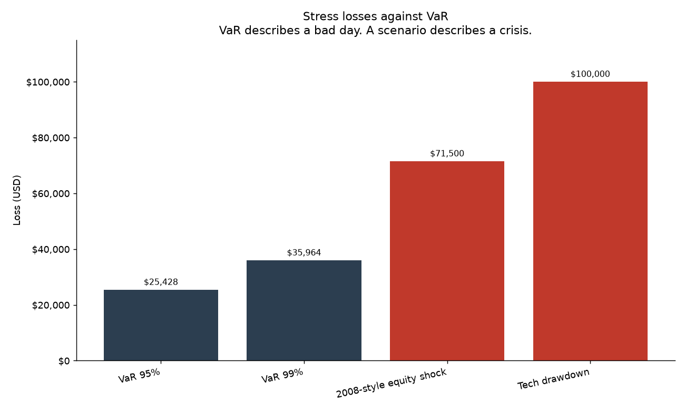
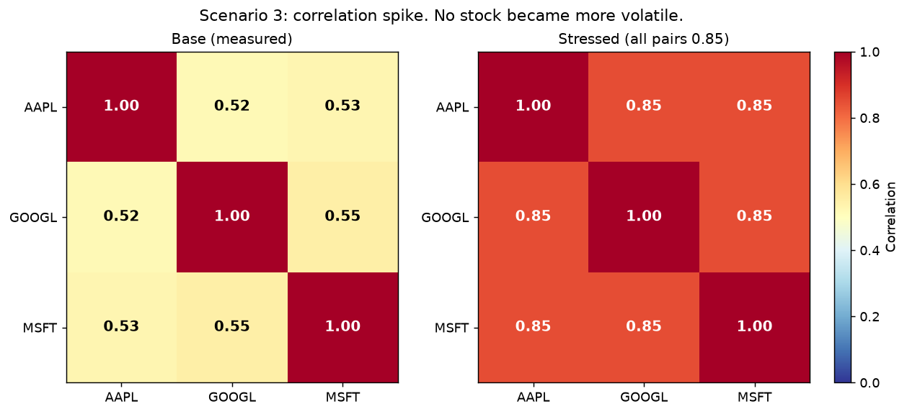

# Portfolio VaR and Stress Testing

A small risk engine for a 3-stock equity portfolio. It computes 1-day
Value-at-Risk by three methods, adds Expected Shortfall, and runs three stress
scenarios.

## Quick start

Needs **Python 3.10 or newer**. Developed and verified on 3.12.7.

```bash
python -m venv .venv
source .venv/bin/activate          # Windows: .venv\Scripts\activate
pip install -r requirements.txt
python main.py
```

`main.py` prints the full report and writes four figures to `plots/`.

Prices are cached in `data/prices.csv` and ship with this project, so the run
works with **no network access**. To download fresh data instead:

```bash
python main.py --refresh      # re-download from Yahoo Finance
python main.py --no-plots     # skip the figures
```

## The portfolio

| Stock | Weight | Value |
|---|---|---|
| AAPL | 40% | $400,000 |
| GOOGL | 35% | $350,000 |
| MSFT | 25% | $250,000 |
| **Total** | **100%** | **$1,000,000** |

Daily adjusted close from Yahoo Finance, 2021-08-30 to 2026-08-28.
1,255 trading days, giving 1,254 daily returns.

Weights, tickers, dates, confidence levels, the random seed, and every shock
size live in `config.py`.

---

## What VaR means

> With 95% confidence, the 1-day loss will not be more than $25,428.
> Equivalently: on the worst 5% of days, the loss is more than $25,428.

Expected Shortfall answers the question VaR leaves open — **how bad is it when
the loss does exceed VaR?** It is the average loss across those worst days.

---

## Part A — Results (1-day, USD)

| Method | VaR 95% | ES 95% | VaR 99% | ES 99% |
|---|---|---|---|---|
| Historical | 25,217 | 33,972 | **38,113** | **47,182** |
| Parametric | 25,428 | 31,888 | 35,964 | 41,203 |
| Monte Carlo | 24,657 | 31,237 | 35,313 | 40,756 |

Portfolio volatility: **1.5459%** per day. Monte Carlo used 100,000 simulations
with a fixed seed.





### The three methods

| Method | Where the distribution comes from | Assumption | Where it fails |
|---|---|---|---|
| **Historical** | The 1,254 days that really happened | The future resembles the sampled past | Cannot show a crash absent from the window. This window has no 2008 and no COVID crash. The 99% figure rests on about 12 observations. |
| **Parametric** | A normal curve fitted to those days | Returns are normal | Real returns have fat tails. Measured here: it understates the 99% loss by $2,149. |
| **Monte Carlo** | 100,000 draws from a mean vector and the covariance matrix | Returns are normal | Inherits the parametric assumption exactly. It is not more accurate here. |

All three are 1-day figures. They say nothing about a slide over a week, and
they assume the position can be exited.

### The correctness check

Monte Carlo and parametric share the same covariance matrix and the same normal
assumption. One solves a formula, the other rolls 100,000 dice. **They must
agree.**

The assignment specifies Method 2 without a mean term and Method 3 *with* a mean
vector, so the two differ slightly by design. Setting the Monte Carlo mean to
zero removes that difference:

| | Parametric | Monte Carlo, zero mean | Gap |
|---|---|---|---|
| 95% | $25,428 | $25,432 | 0.02% |
| 99% | $35,964 | $36,088 | 0.34% |

The remaining gap at 99% is ordinary sampling noise in a thinner tail.

The drift term is also exact. Portfolio mean daily return is 0.07746%, or $775
on $1,000,000 — precisely the distance between the two Monte Carlo variants
($25,432 against $24,657).

### Fat tails, measured

At 95% the three methods agree to within $215. At 99% they separate:

```
Historical VaR 99%   $38,113
Parametric VaR 99%   $35,964      the normal curve is short by $2,149
```

The gap widens for Expected Shortfall — $47,182 against $41,203, a **14%
understatement** — because ES reaches further into the tail.

**The normal assumption is fine in the middle and wrong in the tail, which is
exactly where a risk number has to work.** The right panel of the first figure
shows this directly: real observations stand above the fitted curve below −4%.

### Diversification, measured

```
Weighted-average volatility   1.8576%      <- the wrong answer
True portfolio volatility     1.5459%
Difference                    0.3116% lower
```

That gap is diversification, and it comes entirely from the pair terms in
`w' Σ w`. Forcing every correlation to 1.0 reproduces 1.8576% exactly: when
nothing diversifies, the naive answer becomes the correct one.

---

## Part B — Stress tests

| Scenario | Portfolio return | Loss |
|---|---|---|
| 2008-style equity shock (−8 / −7 / −6%) | −7.15% | **$71,500** |
| Tech drawdown (all −10%) | −10.00% | **$100,000** |



A 99% VaR is meant to be a once-in-a-hundred-days loss. **A modest crisis is
2.0x that, and a 10% drawdown is 2.8x.** VaR describes a bad day; a scenario
describes a crisis. That is why both are needed.

The tech drawdown is a check as well as a scenario: because the weights sum to
1.0, a uniform −10% costs exactly 10% of the portfolio under *any* weighting.

### Scenario 3 — correlation spike

Volatilities are held fixed. Every pairwise correlation is forced to 0.85.



```
per-stock volatility   1.7656%   2.0229%   1.7733%     <- UNCHANGED
portfolio volatility   1.5459%  ->  1.7642%
```

| | Base | Stressed | Increase |
|---|---|---|---|
| Parametric VaR 95% | $25,428 | $29,019 | +$3,590 (+14.1%) |
| Parametric VaR 99% | $35,964 | $41,042 | +$5,078 (+14.1%) |

**No stock became riskier.** Risk rose $3,590 purely because the stocks began
moving together. In a crisis, correlations run toward 1 and diversification
stops working — precisely when it is needed.

The increase is 14.1% at *both* confidence levels because parametric VaR is
linear in volatility, so the `z` cancels in the ratio: 1.7642 / 1.5459 = 1.141.

---

## Design decisions

**Simple returns, not log returns.** The portfolio aggregation
`r_p = Σ wᵢ rᵢ` is exact only for simple returns. Log returns do not add across
assets, which would make the weighted sum an approximation.

**One weighted sum, used everywhere.** `portfolio_returns()` in `data.py` serves
the historical VaR, the Monte Carlo VaR, and both price-shock scenarios. A
scenario is one invented day pushed through the normal pipeline. Because the
aggregation exists in a single place, a scenario and a VaR cannot disagree.

**One empirical VaR function, called twice.** Historical and Monte Carlo VaR
differ only in where the rows come from — 1,254 real days or 100,000 simulated
ones. Everything after that is identical, so `empirical_var()` serves both.

**Zero mean for the parametric method.** The assignment writes
`VaR = z * σ * value`, with no mean term. A daily mean is about 0.08% against a
`z·σ` of about 2.6%, so it moves the answer little and is estimated poorly.
Monte Carlo uses the sample mean vector, as its own specification asks.

**Correlations decomposed, not covariances edited.** Scenario 3 splits Σ into
volatilities and correlations, replaces the correlations, and rebuilds. That is
the only way to hit exactly 0.85 while holding volatility fixed, and it makes
the code state what the scenario means.

**Prices are cached.** Yahoo Finance is a free, unofficial endpoint that
rate-limits and goes down, and it revises history. The cache makes the run
work offline and freezes the numbers reported here.

**Fixed random seed.** Monte Carlo gives identical results on every run.

---

## Project structure

```
config.py       every tunable value: tickers, weights, dates, seed, shocks
data.py         fetch and clean prices, compute returns, aggregate portfolio
risk.py         VaR and Expected Shortfall, all three methods
scenarios.py    stress logic: price shocks and the correlation spike
plots.py        the four figures
main.py         wires it together and prints the report
analysis.ipynb  the same results with commentary, for reading
data/prices.csv cached prices, so the project runs offline
plots/          generated figures
```

Every calculation is a pure function taking inputs and returning outputs, so
each can be tested on its own. `main.py` only wires them together.

### Error handling

The run fails with a clear message, not a stack trace, when:

- Yahoo Finance returns nothing, or omits a requested ticker
- a ticker comes back as an all-`NaN` column, which is how `yfinance` reports a
  partial failure rather than raising
- the weights do not sum to 1.0, or a ticker has no weight
- a scenario omits a shock for a held stock, or a correlation is outside [−1, 1]

The download retries three times, because `yfinance` intermittently returns
`database is locked` from its local cache.

---

## Assumptions and limitations

| Assumption | Applies to | Why it may be wrong |
|---|---|---|
| Returns are normal | Parametric, Monte Carlo | Real returns have fat tails. Measured: the 99% loss is understated by $2,149. |
| The past predicts the future | Historical | The 2021–2026 window holds no 2008 and no COVID crash. |
| Mean daily return is zero | Parametric | True μ is about 0.08% against a `z·σ` of 2.6%. A deliberate simplification. |
| Correlations are stable | Parametric, Monte Carlo | They are not. In a crisis they run toward 1. Scenario 3 quantifies this. |
| Weights stay fixed | All | A real portfolio drifts as prices move, unless rebalanced. |
| One day, and the position can be exited | All | Says nothing about a week-long slide, or about being unable to sell. |
| Every past day counts equally | Historical | A quiet day gets the same weight as a panic day. |
| The shock sizes are right | Scenarios 1–3 | They are chosen by judgment. A stress test gives the consequence of an assumption, never its odds. |

## Not included

**Scenario 4, the rolling VaR breach backtest**, is an optional bonus and is not
implemented. The three VaR methods, Expected Shortfall, and scenarios 1 to 3
cover the required work plus the other bonuses.
